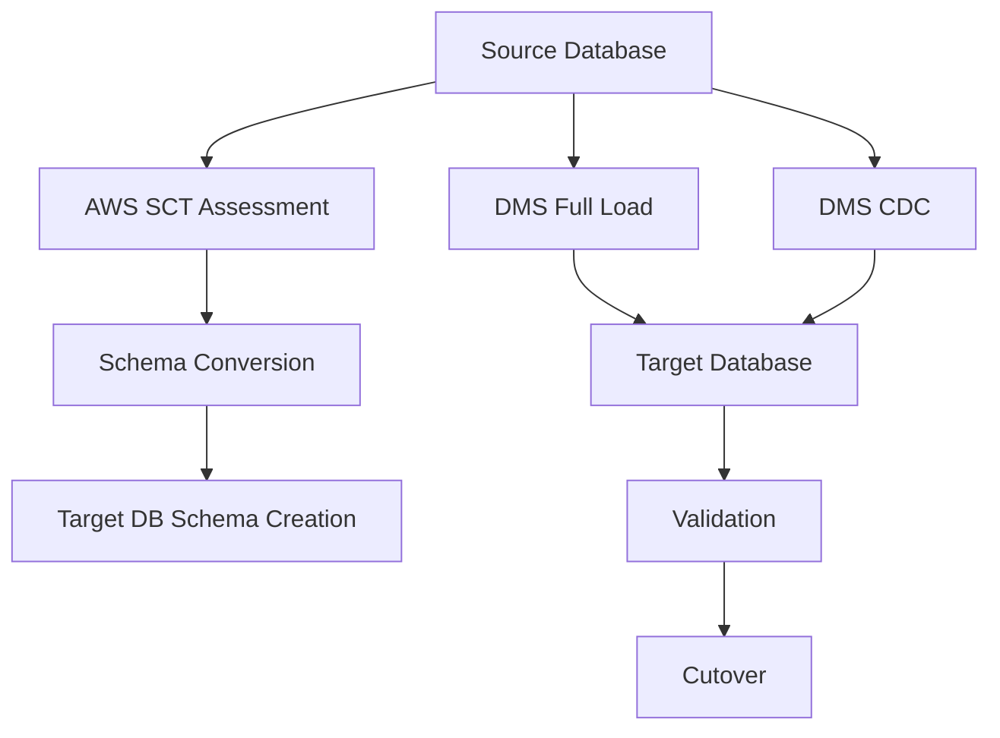
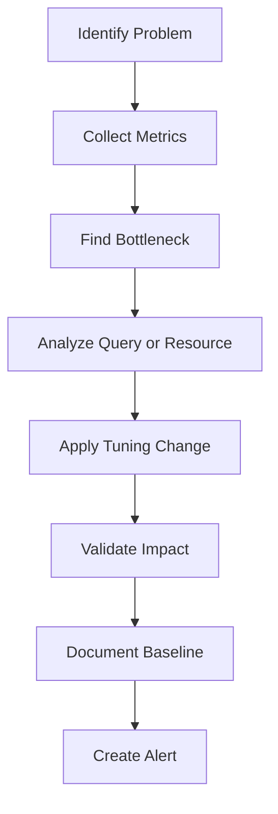

---

# Cloud & AWS for DBAs — Revised TOC

## Track 1: AWS Foundation for DBAs

### Module 1: AWS Infrastructure Basics for DB Workloads

**Topics**

| Area                      | Coverage                                                       |
| ------------------------- | -------------------------------------------------------------- |
| AWS Regions and AZs       | Multi-AZ design, regional failover, latency, data residency    |
| VPC for Databases         | Public/private subnet, route tables, NAT gateway, bastion host |
| Security Groups and NACLs | DB port access, app-to-DB access, IP restrictions              |
| IAM for DBAs              | IAM users, roles, policies, AssumeRole                         |
| SSM Session Manager       | Browser-based secure access without SSH                        |
| CloudWatch Basics         | Metrics, logs, alarms                                          |
| AWS CLI                   | Common DBA commands for RDS, EC2, S3, Backup, DMS              |

**Outcome**

DBAs understand how AWS networking, IAM, monitoring, and access patterns affect database deployment.

---

## Track 2: SQL Server on AWS

### Module 2: SQL Server Deployment Options on AWS

| Option                    | When to Use                                              |
| ------------------------- | -------------------------------------------------------- |
| SQL Server on EC2         | Full control, OS-level access, custom SQL features       |
| SQL Server on RDS         | Managed backup, patching, Multi-AZ, lower admin overhead |
| SQL Server with Always On | Enterprise HA scenarios                                  |
| SQL Server backup to S3   | Migration and restore use cases                          |

### Module 3: SQL Server Performance and Tuning on AWS

**Topics**

| Area                   | Details                                                            |
| ---------------------- | ------------------------------------------------------------------ |
| Performance Insights   | Wait events, SQL load, top queries                                 |
| CloudWatch Metrics     | CPU, memory, read/write IOPS, queue depth, connections             |
| SQL Server DMVs        | `sys.dm_exec_query_stats`, `sys.dm_os_wait_stats`, index usage     |
| Index Tuning           | Missing indexes, fragmented indexes, covering indexes              |
| Parameter Group Tuning | Max degree of parallelism, cost threshold, tempdb-related settings |
| Storage Tuning         | gp3/io2, IOPS, throughput, latency                                 |
| Query Plan Analysis    | Execution plan, scan vs seek, key lookup, sort/hash spills         |

### Module 4: SQL Server Backup, Restore, and DR

| Area             | Coverage                                       |
| ---------------- | ---------------------------------------------- |
| Native Backup    | `.bak` backup to S3                            |
| Restore          | Restore `.bak` into RDS SQL Server             |
| Automated Backup | RDS automated backups and snapshots            |
| PITR             | Point-in-time recovery                         |
| Log Shipping     | EC2 SQL Server to AWS                          |
| DR               | Multi-AZ RDS, cross-region copy, restore drill |

---

## Track 3: PostgreSQL and Aurora PostgreSQL on AWS

### Module 5: PostgreSQL Deployment Options

| Option            | When to Use                               |
| ----------------- | ----------------------------------------- |
| PostgreSQL on EC2 | Full OS and DB control                    |
| RDS PostgreSQL    | Managed PostgreSQL                        |
| Aurora PostgreSQL | Cloud-native PostgreSQL-compatible engine |
| Aurora Serverless | Cost-sensitive or variable workload       |
| Read Replica      | Reporting, scaling reads                  |
| Global Database   | Cross-region DR and low-latency reads     |

### Module 6: PostgreSQL Performance and Tuning

**Topics**

| Area                   | Details                                                                 |
| ---------------------- | ----------------------------------------------------------------------- |
| `pg_stat_statements`   | Track slow and frequently executed queries                              |
| `EXPLAIN ANALYZE`      | Query execution plan validation                                         |
| Vacuum and Analyze     | Table bloat, autovacuum tuning                                          |
| Index Tuning           | B-tree, composite indexes, partial indexes                              |
| Parameter Group Tuning | `work_mem`, `shared_buffers`, `effective_cache_size`, `max_connections` |
| Connection Management  | RDS Proxy, PgBouncer concept                                            |
| Storage Tuning         | IOPS, throughput, read/write latency                                    |
| Aurora Tuning          | Cluster cache, writer/reader endpoints, replica lag                     |

### Module 7: PostgreSQL Backup, Restore, and DR

| Area               | Coverage                          |
| ------------------ | --------------------------------- |
| Logical Backup     | `pg_dump`, `pg_restore`           |
| Physical Backup    | RDS automated backups, snapshots  |
| PITR               | Restore to specific time          |
| Read Replica Clone | Recovery and reporting use case   |
| AWS Backup         | Centralized backup policy         |
| Aurora Global DB   | Cross-region DR                   |
| Validation         | Row count, checksum, query timing |

---

## Track 4: MongoDB, DocumentDB, and Atlas on AWS

### Module 8: MongoDB Deployment Options

| Option               | When to Use                                   |
| -------------------- | --------------------------------------------- |
| MongoDB on EC2       | Full control, self-managed replica set        |
| MongoDB Atlas on AWS | Managed MongoDB with cloud integration        |
| Amazon DocumentDB    | AWS-native MongoDB-compatible managed service |
| Replica Set          | HA and failover                               |
| Sharding             | Horizontal scale for large datasets           |

### Module 9: MongoDB Performance and Tuning

**Topics**

| Area             | Details                                  |
| ---------------- | ---------------------------------------- |
| Query Profiling  | `system.profile`, slow query logs        |
| Index Tuning     | Compound indexes, covered queries        |
| Collection Stats | `db.collection.stats()`                  |
| Database Stats   | `db.stats()`                             |
| Replica Lag      | Primary-secondary replication monitoring |
| Sharding Tuning  | Shard key selection, chunk balancing     |
| CloudWatch Agent | OS and MongoDB log monitoring            |
| Atlas Monitoring | Query profiler, metrics, alerts          |

### Module 10: MongoDB Backup, Restore, and DR

| Area                 | Coverage                                     |
| -------------------- | -------------------------------------------- |
| Logical Backup       | `mongodump`, `mongorestore`                  |
| Snapshot Backup      | EC2/EBS snapshots, Atlas snapshots           |
| PITR                 | Atlas point-in-time recovery                 |
| Change Streams       | Delta sync and event capture                 |
| Cross-region Cluster | Multi-region Atlas                           |
| Failover Testing     | Primary failover, read preference validation |

---

# Track 5: Database Migration on AWS

## Module 11: Migration Strategy and Planning

### Migration Lifecycle

| Stage             | SQL Server                          | PostgreSQL                        | MongoDB                                             |
| ----------------- | ----------------------------------- | --------------------------------- | --------------------------------------------------- |
| Source Assessment | DB size, compatibility, users, jobs | Extensions, schemas, indexes      | Collections, indexes, shard keys                    |
| Backup            | `.bak`, export                      | `pg_dump`, snapshot               | `mongodump`, snapshot                               |
| Migration Tool    | DMS, native restore, log shipping   | DMS, SCT, pg_restore              | DMS, mongorestore, Atlas tools                      |
| Validation        | DBCC, row count, checksum           | Row count, checksum, query timing | Collection count, document count, script validation |
| Cutover           | DNS switch, CDC stop                | Role promotion, CDC stop          | Change stream sync, failover                        |
| Rollback          | Restore `.bak`, DNS revert          | PITR, snapshot restore            | Snapshot restore, replica rehydration               |

---

## Module 12: AWS DMS and SCT Deep Dive

| Tool                     | Purpose                                    |
| ------------------------ | ------------------------------------------ |
| AWS SCT                  | Schema conversion and assessment           |
| AWS DMS Full Load        | One-time data migration                    |
| AWS DMS CDC              | Continuous change replication              |
| DMS Replication Instance | Compute for migration task                 |
| DMS Endpoints            | Source and target DB connection            |
| DMS Validation           | Table-level validation and mismatch checks |

### DMS Execution Flow

---

# Track 6: Backup, Restore, and Disaster Recovery

## Module 13: Backup Strategy for DBAs

| Backup Type            | Use Case                       |
| ---------------------- | ------------------------------ |
| Full Backup            | Complete recovery baseline     |
| Incremental Backup     | Save changed data only         |
| Transaction Log Backup | Point-in-time recovery         |
| Snapshot               | Fast cloud-native backup       |
| Cross-region Copy      | DR readiness                   |
| Logical Dump           | Migration or selective restore |
| AWS Backup             | Centralized backup governance  |

---

## Module 14: Restore and Recovery Validation

### Restore Validation Checklist

| Step                   | Validation                                  |
| ---------------------- | ------------------------------------------- |
| Restore completed      | DB is online and accessible                 |
| Schema validation      | Table, view, index, procedure count matched |
| Data validation        | Row count and checksum matched              |
| Application validation | App connects successfully                   |
| Query validation       | Top 10 business queries tested              |
| Performance validation | Query timing compared with source           |
| Security validation    | Users, roles, SSL, encryption checked       |
| Backup validation      | New backup created after restore            |

---

# Track 7: Performance Monitoring and Tuning

## Module 15: AWS Monitoring for DBAs

| Tool                 | Usage                                   |
| -------------------- | --------------------------------------- |
| CloudWatch Metrics   | CPU, memory, storage, IOPS, connections |
| CloudWatch Logs      | Error logs, slow logs, audit logs       |
| Performance Insights | Query load and wait events              |
| Enhanced Monitoring  | OS-level RDS metrics                    |
| CloudTrail           | Audit AWS API activity                  |
| AWS Config           | Compliance tracking                     |
| SNS                  | Alert notifications                     |

---

## Module 16: Tuning Methodology

### Standard DBA Tuning Workflow

### Tuning Areas

| Area          | What to Check                                       |
| ------------- | --------------------------------------------------- |
| CPU           | High CPU queries, parallelism, inefficient plans    |
| Memory        | Buffer cache, sort/hash spills, connection pressure |
| Disk          | Read/write latency, IOPS, queue depth               |
| Network       | Cross-AZ latency, app-to-DB round trip              |
| Query         | Full scans, bad joins, missing indexes              |
| Locks         | Blocking sessions, deadlocks                        |
| Replication   | Replica lag, CDC delay                              |
| Backup Impact | Snapshot or dump performance impact                 |

---

# Track 8: Security, Secrets, and Compliance

## Module 17: Secure Database Access on AWS

| Area                | Coverage                        |
| ------------------- | ------------------------------- |
| IAM                 | Least privilege policies        |
| Secrets Manager     | Store and rotate DB credentials |
| KMS                 | Encrypt RDS, EBS, S3 backups    |
| SSL/TLS             | Force encrypted DB connections  |
| SSM Session Manager | Secure browser-based access     |
| Audit Logs          | DB logs, CloudTrail, CloudWatch |
| Compliance          | PCI-DSS, HIPAA, GDPR basics     |

---

# Separate Lab Plan

# Lab Block 1: AWS DBA Foundation Labs

## Lab 1: Create DBA VPC for Database Workloads

**Goal:** Build secure AWS networking for DB workloads.

**Steps**

1. Create VPC.
2. Create public and private subnets.
3. Create Internet Gateway.
4. Create NAT Gateway.
5. Create route tables.
6. Launch bastion EC2 or configure SSM Session Manager.
7. Create Security Groups for app and DB access.

**Validation**

| Check              | Expected Result                              |
| ------------------ | -------------------------------------------- |
| DB subnet private  | No direct public access                      |
| Bastion/SSM access | Admin can access private resource            |
| Security Group     | Only allowed DB ports are open               |
| Route table        | Private subnet uses NAT for outbound traffic |

---

## Lab 2: Configure SSM Session Manager for Browser-Based Access

**Goal:** Access EC2 without SSH or `.pem`.

**Steps**

1. Attach IAM role to EC2 with `AmazonSSMManagedInstanceCore`.
2. Verify SSM Agent is running.
3. Open AWS Console.
4. Go to Systems Manager.
5. Start Session Manager session.
6. Connect to EC2 from browser.

**Validation**

| Check                 | Expected Result                  |
| --------------------- | -------------------------------- |
| SSH port closed       | EC2 still accessible through SSM |
| Session Manager works | Browser terminal opens           |
| CloudTrail logs       | Session activity is audited      |

---

# Lab Block 2: SQL Server Labs

## Lab 3: Launch SQL Server RDS with Multi-AZ

**Steps**

1. Create SQL Server RDS instance.
2. Select Standard/Enterprise edition.
3. Enable Multi-AZ.
4. Create custom parameter group.
5. Configure backup retention.
6. Enable Performance Insights.
7. Connect using SSMS.

**Validation**

| Check                | Expected Result |
| -------------------- | --------------- |
| RDS status           | Available       |
| Multi-AZ             | Enabled         |
| Backup retention     | Configured      |
| SSMS connection      | Successful      |
| Performance Insights | Collecting data |

---

## Lab 4: Restore SQL Server `.bak` from S3 to RDS

**Steps**

1. Take `.bak` backup from source SQL Server.
2. Upload `.bak` to S3.
3. Create IAM role for RDS S3 access.
4. Attach option group with SQL Server backup/restore option.
5. Run restore command from SSMS.
6. Verify database is online.

**Validation**

| Check           | Expected Result |
| --------------- | --------------- |
| S3 backup file  | Present         |
| IAM role        | Attached to RDS |
| Restore task    | Completed       |
| Database status | Online          |
| Row count       | Matches source  |

---

## Lab 5: SQL Server Performance Tuning with Performance Insights

**Steps**

1. Generate sample workload.
2. Open Performance Insights.
3. Identify top SQL statements.
4. Check waits.
5. Capture execution plan.
6. Add missing index or tune query.
7. Re-run workload.

**Validation**

| Metric               |   Before |   After |
| -------------------- | -------: | ------: |
| Query execution time |   Higher |   Lower |
| CPU load             |   Higher | Reduced |
| Logical reads        |   Higher | Reduced |
| Wait event           | Dominant | Reduced |

---

# Lab Block 3: PostgreSQL Labs

## Lab 6: Deploy RDS PostgreSQL with Monitoring

**Steps**

1. Create RDS PostgreSQL.
2. Use private subnet group.
3. Enable Enhanced Monitoring.
4. Enable Performance Insights.
5. Configure parameter group.
6. Connect using `psql` or pgAdmin.

**Validation**

| Check               | Expected Result             |
| ------------------- | --------------------------- |
| RDS status          | Available                   |
| Private access      | No public endpoint access   |
| `psql` connection   | Successful from bastion/app |
| Enhanced Monitoring | Enabled                     |

---

## Lab 7: Enable `pg_stat_statements` and Tune Slow Query

**Steps**

1. Modify parameter group.
2. Add `pg_stat_statements` to shared preload libraries.
3. Restart DB if required.
4. Create extension.
5. Run sample slow query.
6. Analyze using `pg_stat_statements`.
7. Run `EXPLAIN ANALYZE`.
8. Create index.
9. Re-test query.

**Validation**

| Check                  | Expected Result               |
| ---------------------- | ----------------------------- |
| Extension installed    | Yes                           |
| Slow query captured    | Yes                           |
| Execution plan changed | Sequential scan to index scan |
| Query time             | Reduced                       |

---

## Lab 8: PostgreSQL Backup and PITR Restore

**Steps**

1. Enable automated backups.
2. Create test table.
3. Insert sample data.
4. Take manual snapshot.
5. Delete or corrupt sample data.
6. Restore DB to point in time.
7. Validate restored data.

**Validation**

| Check                  | Expected Result |
| ---------------------- | --------------- |
| Snapshot available     | Yes             |
| PITR restore complete  | Yes             |
| Data recovered         | Yes             |
| Application connection | Successful      |

---

# Lab Block 4: MongoDB Labs

## Lab 9: Deploy MongoDB Replica Set on EC2

**Steps**

1. Launch three EC2 instances.
2. Install Docker and Docker Compose.
3. Start MongoDB containers.
4. Configure replica set.
5. Add secondary nodes.
6. Insert sample data.
7. Test primary failover.

**Validation**

| Check              | Expected Result     |
| ------------------ | ------------------- |
| Replica set status | Healthy             |
| Primary node       | Elected             |
| Secondary nodes    | Syncing             |
| Failover           | New primary elected |

---

## Lab 10: MongoDB Performance Tuning

**Steps**

1. Insert large sample collection.
2. Run query without index.
3. Check execution stats.
4. Create compound index.
5. Re-run query.
6. Enable profiler.
7. Review slow query logs.

**Validation**

| Metric            |  Before |   After |
| ----------------- | ------: | ------: |
| Documents scanned |    High |     Low |
| Query time        |    High | Reduced |
| Index usage       |      No |     Yes |
| Slow log entry    | Present | Reduced |

---

# Lab Block 5: Migration Labs

## Lab 11: SQL Server EC2 to RDS Migration

**Migration Method:** Native backup + DMS CDC.

**Steps**

1. Prepare SQL Server on EC2.
2. Check compatibility.
3. Take native `.bak` backup.
4. Upload backup to S3.
5. Restore backup into RDS SQL Server.
6. Create DMS replication instance.
7. Create source and target endpoints.
8. Start DMS CDC task.
9. Monitor replication latency.
10. Stop application writes.
11. Allow CDC to catch up.
12. Switch application connection string to RDS.

**Validation**

| Area        | Validation                                |
| ----------- | ----------------------------------------- |
| Schema      | Objects match                             |
| Data        | Row count and checksum match              |
| CDC         | Replication latency near zero             |
| App         | Connects to RDS                           |
| Performance | Top queries tested                        |
| Rollback    | EC2 source still available until sign-off |

---

## Lab 12: Oracle to Aurora PostgreSQL using SCT and DMS

**Steps**

1. Install AWS SCT.
2. Connect SCT to Oracle source.
3. Generate assessment report.
4. Convert schema to PostgreSQL.
5. Apply schema to Aurora PostgreSQL.
6. Create DMS full load task.
7. Enable CDC.
8. Validate data.
9. Tune PostgreSQL parameter group.
10. Execute cutover.

**Validation**

| Check              | Expected Result |
| ------------------ | --------------- |
| SCT report         | Reviewed        |
| Schema conversion  | Completed       |
| Full load          | Completed       |
| CDC latency        | Controlled      |
| Query output       | Matches Oracle  |
| Aurora performance | Acceptable      |

---

## Lab 13: MongoDB to Atlas Migration

**Steps**

1. Create source MongoDB replica set.
2. Run `mongodump`.
3. Create Atlas cluster.
4. Import using `mongorestore`.
5. Configure users and IP access.
6. Enable TLS.
7. Configure cross-region replication.
8. Test read/write operations.
9. Test failover.

**Validation**

| Check           | Expected Result   |
| --------------- | ----------------- |
| Collections     | Match source      |
| Document count  | Match source      |
| Indexes         | Created correctly |
| Application URI | Updated           |
| Failover        | Successful        |
| Read preference | Working           |

---

# Lab Block 6: Backup and DR Labs

## Lab 14: AWS Backup for RDS

**Steps**

1. Create AWS Backup vault.
2. Create backup plan.
3. Assign RDS resources using tags.
4. Run on-demand backup.
5. Restore backup to new RDS instance.
6. Validate restored DB.

**Validation**

| Check        | Expected Result         |
| ------------ | ----------------------- |
| Backup job   | Completed               |
| Backup vault | Contains recovery point |
| Restore job  | Completed               |
| Restored DB  | Accessible              |
| Data         | Verified                |

---

## Lab 15: Cross-Region DR Simulation

**Steps**

1. Enable automated backup/snapshot.
2. Copy snapshot to another region.
3. Restore DB in DR region.
4. Configure Security Group and subnet.
5. Update test application endpoint.
6. Run validation queries.

**Validation**

| Area                 | Expected Result |
| -------------------- | --------------- |
| Snapshot copy        | Completed       |
| Restore in DR region | Successful      |
| Application test     | Successful      |
| RTO                  | Measured        |
| RPO                  | Measured        |

---

# Lab Block 7: Security and Cloud Integration Labs

## Lab 16: Secrets Manager Integration with RDS PostgreSQL

**Steps**

1. Create RDS PostgreSQL.
2. Store DB credentials in Secrets Manager.
3. Enable automatic rotation.
4. Attach IAM permission to application/EC2 role.
5. Retrieve secret at runtime.
6. Connect to DB using retrieved credentials.
7. Rotate secret.
8. Validate app connection again.

**Validation**

| Check                | Expected Result        |
| -------------------- | ---------------------- |
| Secret stored        | Yes                    |
| Rotation enabled     | Yes                    |
| App retrieves secret | Yes                    |
| Old password         | Invalid after rotation |
| New password         | Works                  |

---

## Lab 17: KMS Encryption and Audit Logging

**Steps**

1. Create KMS CMK.
2. Enable encryption for RDS.
3. Enable S3 backup encryption.
4. Enable CloudTrail.
5. Generate DB activity.
6. Query CloudTrail logs.
7. Validate encryption and audit events.

**Validation**

| Check           | Expected Result |
| --------------- | --------------- |
| RDS encrypted   | Yes             |
| S3 encrypted    | Yes             |
| KMS key used    | Yes             |
| CloudTrail logs | Captured        |
| Audit event     | Searchable      |

---

# Final Project Labs

## Project 1: End-to-End SQL Server Migration to AWS

**Scope**

SQL Server on EC2 to RDS SQL Server using backup restore + DMS CDC.

**Must Include**

1. Backup.
2. Restore.
3. CDC.
4. Validation.
5. Performance tuning.
6. Cutover.
7. Rollback plan.
8. DR snapshot.

---

## Project 2: PostgreSQL Cloud-Native DBA Project

**Scope**

Deploy RDS/Aurora PostgreSQL with backup, tuning, monitoring, and Secrets Manager integration.

**Must Include**

1. Private subnet deployment.
2. Parameter group tuning.
3. `pg_stat_statements`.
4. Slow query tuning.
5. PITR restore.
6. Secrets Manager rotation.
7. CloudWatch alarm.
8. Cost review.

---

## Project 3: MongoDB Cloud Migration and HA Project

**Scope**

Migrate MongoDB replica set to Atlas or DocumentDB and validate HA.

**Must Include**

1. Source replica set.
2. Backup/export.
3. Restore/import.
4. Index validation.
5. Query tuning.
6. Failover.
7. TLS.
8. Monitoring.

---

# Recommended Lab Environment

| Component    | Recommendation                                      |
| ------------ | --------------------------------------------------- |
| AWS Account  | Dedicated training account                          |
| Access       | IAM users or federated access                       |
| Region       | Mumbai or Singapore for India-based trainees        |
| EC2          | t3.medium/t3.large for SQL/Mongo labs               |
| RDS          | db.t3.medium or db.t4g.medium where supported       |
| Storage      | gp3                                                 |
| Tools        | AWS CLI, SSMS, pgAdmin, psql, Mongo Compass         |
| Security     | SSM Session Manager preferred over SSH              |
| Cost Control | Auto-stop EC2, short-lived RDS labs, cleanup script |

