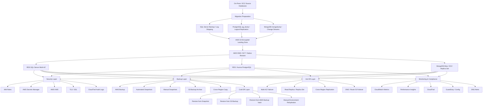
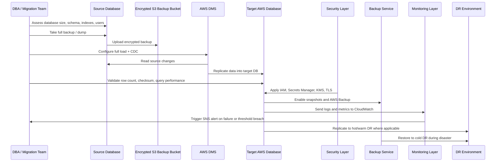
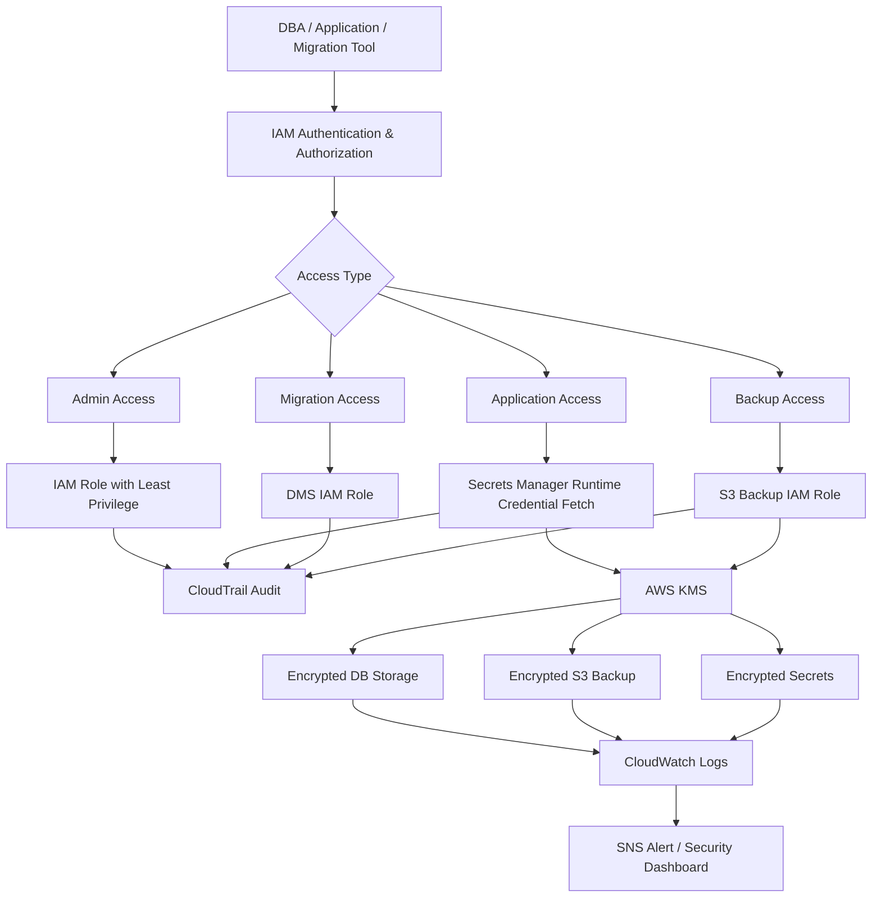
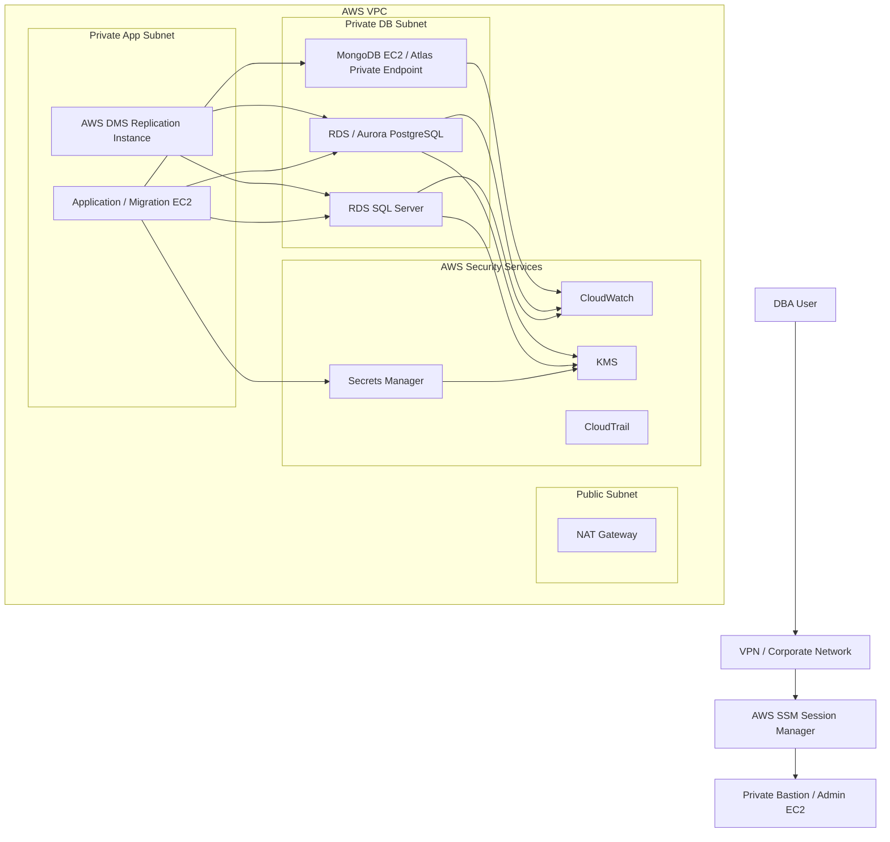
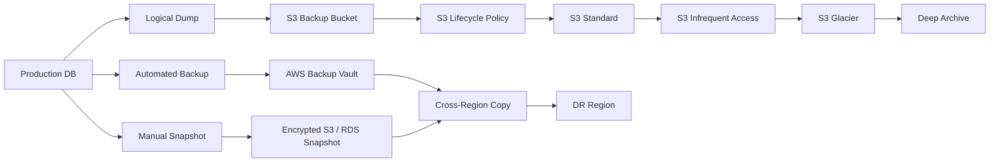
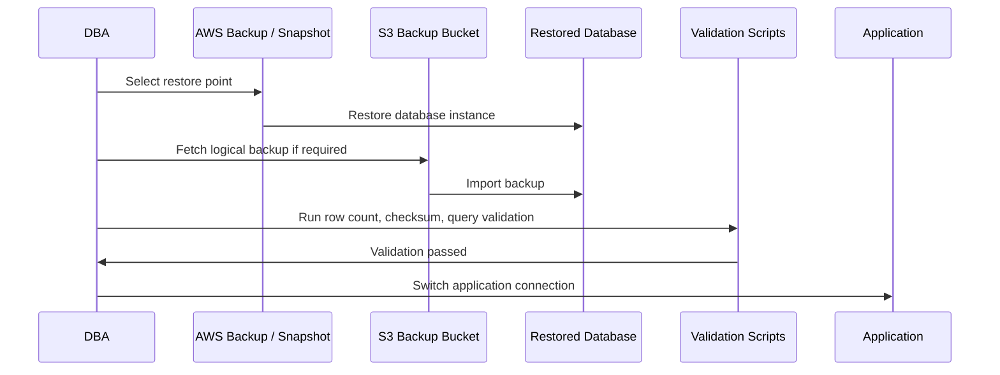
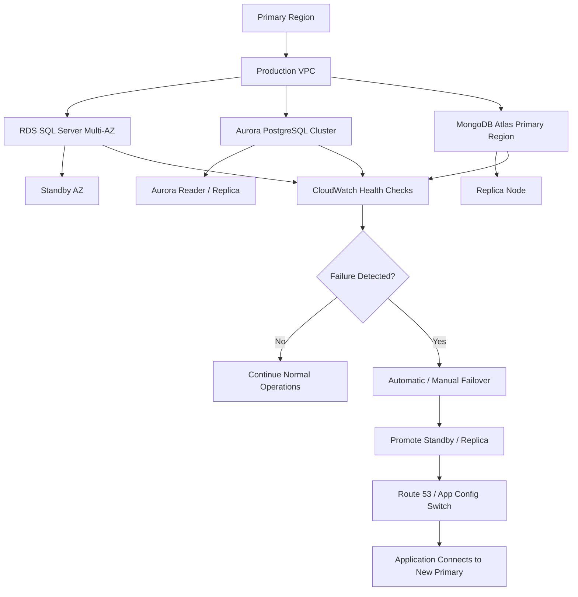
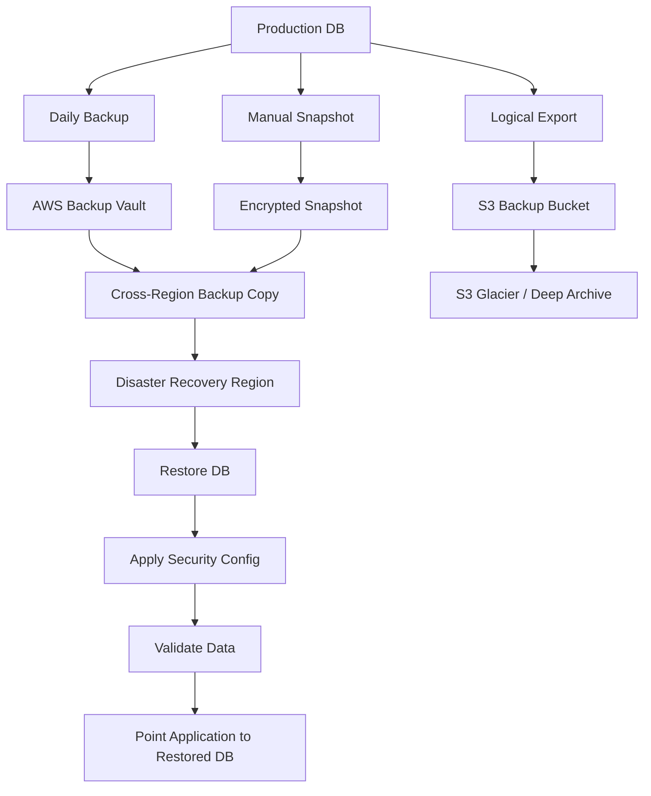

---

# POC Title

## Cloud & AWS DBA Enterprise POC

### Secure Migration, Backup, Restore, HA, Hot DR and Cold DR for SQL Server, PostgreSQL and MongoDB

---

# 1. POC Objective

The goal of this POC is to demonstrate how enterprise DBAs can design, migrate, secure, monitor, back up, restore, and recover databases on AWS.

This POC should cover:

| Area               | What the POC Will Demonstrate                              |
| ------------------ | ---------------------------------------------------------- |
| Database Migration | SQL Server / PostgreSQL / MongoDB migration to AWS         |
| Backup Strategy    | Native backup, AWS Backup, snapshots, logical backups      |
| Restore Strategy   | PITR, snapshot restore, logical restore, backup validation |
| Security           | IAM, Secrets Manager, KMS, TLS/SSL, audit logs             |
| HA                 | Multi-AZ, replica set, read replica, failover              |
| Hot DR             | Near real-time replication and fast failover               |
| Cold DR            | Backup-based recovery from S3 / AWS Backup                 |
| Monitoring         | CloudWatch, Performance Insights, logs, alerts             |
| Compliance         | PCI-DSS, audit trails, encryption, retention               |
| Cost Optimization  | Hot vs warm vs cold environment cost comparison            |

---

# 2. POC Business Scenario

Assume an enterprise has three types of databases:

| Application             | Existing DB                 | Target AWS DB                               |
| ----------------------- | --------------------------- | ------------------------------------------- |
| Core Payment System     | SQL Server on EC2 / on-prem | Amazon RDS SQL Server                       |
| Customer Profile System | PostgreSQL on-prem          | Amazon RDS / Aurora PostgreSQL              |
| Activity / Audit Logs   | MongoDB replica set         | MongoDB Atlas / DocumentDB-style evaluation |

The organization wants to move to AWS while ensuring:

1. No major data loss
2. Minimal downtime
3. Encrypted backups
4. Secure credential management
5. DR readiness
6. Audit and compliance visibility
7. Cost-effective hot and cold recovery options

---

# 3. High-Level Architecture Flow

---

# 4. POC Scope

## In Scope

| Category   | Included                                                             |
| ---------- | -------------------------------------------------------------------- |
| SQL Server | RDS SQL Server, backup restore, DMS CDC, Multi-AZ                    |
| PostgreSQL | RDS / Aurora PostgreSQL, pg_dump, PITR, IAM auth, read replica       |
| MongoDB    | EC2 replica set or MongoDB Atlas, mongodump, restore, change streams |
| Security   | IAM, KMS, Secrets Manager, SSL/TLS, audit logs                       |
| Backup     | Native backup, snapshots, AWS Backup, S3 lifecycle                   |
| DR         | Hot DR and cold DR                                                   |
| Monitoring | CloudWatch, Performance Insights, SNS                                |
| Compliance | Encryption, audit trail, retention policy, tagging                   |
| Cost       | Hot vs cold DR cost comparison                                       |

## Out of Scope for POC

| Area                                    | Reason                                  |
| --------------------------------------- | --------------------------------------- |
| Full production data migration          | POC uses sample or masked data          |
| Enterprise license finalization         | Depends on customer agreement           |
| Full multi-region production deployment | Simulated in POC with limited resources |
| Complete application refactoring        | Focus is DBA and infrastructure layer   |

---

# 5. POC Architecture Components

| Layer             | AWS / Tooling Used                                        |
| ----------------- | --------------------------------------------------------- |
| Compute           | EC2 for source DB simulation and bastion                  |
| Network           | VPC, private subnets, public subnet, NAT, security groups |
| SQL Server Target | Amazon RDS SQL Server                                     |
| PostgreSQL Target | Amazon RDS PostgreSQL or Aurora PostgreSQL                |
| MongoDB Target    | MongoDB Atlas or EC2 replica set                          |
| Migration         | AWS DMS, AWS SCT, native backup/restore                   |
| Backup            | AWS Backup, RDS snapshots, S3                             |
| Secrets           | AWS Secrets Manager, SSM Parameter Store                  |
| Encryption        | AWS KMS, TLS/SSL, TDE where applicable                    |
| Monitoring        | CloudWatch, Performance Insights                          |
| Audit             | CloudTrail, RDS logs, MongoDB audit logs                  |
| DR                | Multi-AZ, read replica, cross-region snapshot copy        |
| Automation        | Terraform / CloudFormation optional                       |

---

# 6. Hot, Warm and Cold Strategy

## 6.1 Hot Path

Hot path means the database is actively running with high availability and quick failover.

| DB         | Hot Strategy                                        |
| ---------- | --------------------------------------------------- |
| SQL Server | RDS SQL Server Multi-AZ                             |
| PostgreSQL | Aurora PostgreSQL Multi-AZ / read replica           |
| MongoDB    | Multi-node replica set / Atlas multi-region cluster |

### Hot DR Characteristics

| Item     | Value                                                  |
| -------- | ------------------------------------------------------ |
| RTO      | Minutes                                                |
| RPO      | Seconds to minutes                                     |
| Cost     | High                                                   |
| Use Case | Payment, banking, core transaction systems             |
| Example  | If primary AZ fails, standby is promoted automatically |

---

## 6.2 Warm Path

Warm path means the secondary system is partially ready but may need manual promotion or scaling.

| DB         | Warm Strategy                                      |
| ---------- | -------------------------------------------------- |
| SQL Server | Log shipping / DMS CDC to standby DB               |
| PostgreSQL | Read replica in another AZ or region               |
| MongoDB    | Secondary replica set node in another AZ or region |

### Warm DR Characteristics

| Item     | Value                                                   |
| -------- | ------------------------------------------------------- |
| RTO      | 15 minutes to 1 hour                                    |
| RPO      | Minutes                                                 |
| Cost     | Medium                                                  |
| Use Case | Reporting, analytics, less critical business systems    |
| Example  | Promote read replica during regional or primary failure |

---

## 6.3 Cold Path

Cold path means no always-running secondary DB. Recovery happens from backup.

| DB         | Cold Strategy                                    |
| ---------- | ------------------------------------------------ |
| SQL Server | Restore `.bak` from encrypted S3 bucket          |
| PostgreSQL | Restore from snapshot / pg_dump / PITR           |
| MongoDB    | Restore from mongodump / snapshot / Atlas backup |

### Cold DR Characteristics

| Item     | Value                                                      |
| -------- | ---------------------------------------------------------- |
| RTO      | Hours                                                      |
| RPO      | Last successful backup                                     |
| Cost     | Low                                                        |
| Use Case | Non-critical workloads, archive systems, dev/test recovery |
| Example  | Restore RDS from last nightly snapshot                     |

---

# 7. Detailed POC Flow

---

# 8. SQL Server POC

## SQL Server Use Case

Migrate SQL Server running on EC2 or on-prem to Amazon RDS SQL Server.

### SQL Server POC Steps

| Step | Activity                                        |
| ---- | ----------------------------------------------- |
| 1    | Launch source SQL Server on EC2                 |
| 2    | Create sample banking/payment database          |
| 3    | Take native `.bak` backup                       |
| 4    | Upload backup to encrypted S3 bucket            |
| 5    | Create RDS SQL Server Multi-AZ instance         |
| 6    | Restore `.bak` file into RDS                    |
| 7    | Configure DMS CDC from source to RDS            |
| 8    | Validate migration using row count and checksum |
| 9    | Enable automated backups and snapshots          |
| 10   | Enable CloudWatch and Performance Insights      |
| 11   | Test Multi-AZ failover                          |
| 12   | Restore from backup into new RDS instance       |

### SQL Server Security Controls

| Control               | Implementation                       |
| --------------------- | ------------------------------------ |
| Encryption at rest    | RDS encryption with KMS              |
| Encryption in transit | Force SSL                            |
| Backup encryption     | S3 bucket with KMS                   |
| Access control        | IAM role for S3 restore              |
| Secrets               | Store DB password in Secrets Manager |
| Audit                 | SQL Server audit logs + CloudWatch   |
| TDE                   | Enable where edition supports it     |

### SQL Server Hot / Cold

| Type | Implementation                               |
| ---- | -------------------------------------------- |
| Hot  | RDS SQL Server Multi-AZ                      |
| Warm | Log shipping / DMS CDC                       |
| Cold | `.bak` restore from S3 / AWS Backup snapshot |

---

# 9. PostgreSQL POC

## PostgreSQL Use Case

Migrate PostgreSQL or MySQL/Oracle-style workload to Amazon RDS PostgreSQL or Aurora PostgreSQL.

### PostgreSQL POC Steps

| Step | Activity                                   |
| ---- | ------------------------------------------ |
| 1    | Launch source PostgreSQL on EC2            |
| 2    | Create customer/account/payment tables     |
| 3    | Take logical backup using `pg_dump`        |
| 4    | Restore schema and data using `pg_restore` |
| 5    | Use AWS SCT if migrating from Oracle/MySQL |
| 6    | Configure DMS full load + CDC              |
| 7    | Enable `pg_stat_statements`                |
| 8    | Enable SSL enforcement                     |
| 9    | Enable IAM DB authentication               |
| 10   | Store credentials in Secrets Manager       |
| 11   | Enable automated backups and PITR          |
| 12   | Create read replica                        |
| 13   | Test failover or replica promotion         |
| 14   | Restore DB to point-in-time                |

### PostgreSQL Security Controls

| Control            | Implementation                       |
| ------------------ | ------------------------------------ |
| IAM authentication | Enable `rds_iam`                     |
| Secrets            | Use Secrets Manager rotation         |
| SSL                | Force SSL using parameter group      |
| Encryption         | KMS encryption for RDS               |
| Audit              | PostgreSQL logs to CloudWatch        |
| Row-level security | Use RLS for sensitive tables         |
| Least privilege    | Separate admin, app, read-only users |

### PostgreSQL Hot / Cold

| Type | Implementation                            |
| ---- | ----------------------------------------- |
| Hot  | Aurora Multi-AZ / RDS Multi-AZ            |
| Warm | Read replica / logical replication        |
| Cold | Snapshot restore / PITR / pg_dump restore |

---

# 10. MongoDB POC

## MongoDB Use Case

Migrate MongoDB workload from EC2 or on-prem to MongoDB Atlas or AWS-hosted replica set.

### MongoDB POC Steps

| Step | Activity                                      |
| ---- | --------------------------------------------- |
| 1    | Deploy 3-node MongoDB replica set on EC2      |
| 2    | Create sample customer activity collections   |
| 3    | Run `db.stats()` and index analysis           |
| 4    | Take `mongodump` backup                       |
| 5    | Restore using `mongorestore`                  |
| 6    | Configure MongoDB Atlas target cluster        |
| 7    | Enable TLS                                    |
| 8    | Configure IP allowlist                        |
| 9    | Enable backup and PITR in Atlas               |
| 10   | Enable change streams for delta sync          |
| 11   | Validate document count and index performance |
| 12   | Simulate primary failover                     |
| 13   | Test restore from snapshot                    |

### MongoDB Security Controls

| Control               | Implementation                             |
| --------------------- | ------------------------------------------ |
| Encryption at rest    | Atlas encryption / KMS BYOK                |
| Encryption in transit | TLS enabled                                |
| Network access        | IP allowlist / private endpoint            |
| Secrets               | Store connection string in Secrets Manager |
| Audit                 | MongoDB audit logs                         |
| RBAC                  | Database-level role mapping                |
| Backup                | Atlas backups / snapshots                  |

### MongoDB Hot / Cold

| Type | Implementation                           |
| ---- | ---------------------------------------- |
| Hot  | Atlas multi-region cluster / replica set |
| Warm | Secondary replica in another AZ          |
| Cold | mongodump / snapshot restore             |

---

# 11. Security Architecture

---

# 12. Security Controls Checklist

| Security Area         | Control                                 | POC Validation                         |
| --------------------- | --------------------------------------- | -------------------------------------- |
| IAM                   | Least privilege IAM policies            | Try allowed and denied actions         |
| Secrets               | Store DB credentials in Secrets Manager | Rotate secret and reconnect            |
| Encryption at rest    | KMS for RDS, EBS, S3                    | Verify encryption status               |
| Encryption in transit | SSL/TLS enforced                        | Try non-SSL connection and reject      |
| Network               | DB in private subnet                    | Public access should fail              |
| Access path           | SSM Session Manager instead of SSH      | Connect without opening port 22        |
| Audit                 | CloudTrail enabled                      | Verify DB/admin API activity           |
| Monitoring            | CloudWatch logs                         | Check failed login and slow query logs |
| Backup protection     | S3 versioning + lifecycle               | Verify backup object retention         |
| Compliance            | Tags and retention policy               | Validate resource tagging              |

---

# 13. Network Architecture

---

# 14. Backup Strategy

## Backup Types

| Backup Type       | SQL Server           | PostgreSQL          | MongoDB                   |
| ----------------- | -------------------- | ------------------- | ------------------------- |
| Native backup     | `.bak`               | `pg_dump`           | `mongodump`               |
| Snapshot          | RDS snapshot         | RDS/Aurora snapshot | EBS/Atlas snapshot        |
| PITR              | RDS automated backup | RDS/Aurora PITR     | Atlas PITR                |
| Logical backup    | Export tables        | pg_dump schema/data | BSON/JSON dump            |
| Cross-region copy | RDS snapshot copy    | RDS snapshot copy   | Atlas cross-region backup |
| Archive           | S3 Glacier           | S3 Glacier          | S3 Glacier                |

---

## Backup Flow

---

# 15. Backup Policy

| Environment         | Backup Frequency       | Retention | Storage                 |
| ------------------- | ---------------------- | --------- | ----------------------- |
| Production          | Daily automated backup | 35 days   | AWS Backup / RDS        |
| Production critical | Transaction log / PITR | 7–35 days | RDS PITR                |
| Weekly              | Full snapshot          | 12 weeks  | S3 / AWS Backup         |
| Monthly             | Compliance snapshot    | 12 months | S3 Glacier              |
| Yearly              | Audit archive          | 7 years   | S3 Glacier Deep Archive |
| Dev/Test            | Weekly                 | 7–14 days | Low-cost snapshot       |

---

# 16. Restore Strategy

| Restore Scenario            | Method                                |
| --------------------------- | ------------------------------------- |
| Accidental table deletion   | PITR restore to new DB                |
| Full DB corruption          | Restore latest snapshot               |
| Region failure              | Cross-region snapshot restore         |
| Data validation issue       | Restore backup to staging and compare |
| Ransomware-style incident   | Restore immutable backup copy         |
| Developer test data refresh | Restore sanitized snapshot            |

---

## Restore Flow

---

# 17. Hot DR Design

## Hot DR Architecture

---

## Hot DR Validation

| Test                            | Expected Result                         |
| ------------------------------- | --------------------------------------- |
| Stop primary DB instance        | Standby should become primary           |
| Force Aurora failover           | Reader should be promoted               |
| Kill MongoDB primary            | Secondary should be elected primary     |
| Run app traffic during failover | Temporary errors but no major data loss |
| Check RPO                       | Near-zero or seconds-level              |
| Check RTO                       | Few minutes                             |

---

# 18. Cold DR Design

## Cold DR Architecture

---

## Cold DR Validation

| Test                             | Expected Result                                |
| -------------------------------- | ---------------------------------------------- |
| Restore SQL Server from `.bak`   | DB should be available                         |
| Restore PostgreSQL from snapshot | DB should match selected restore point         |
| Restore MongoDB from dump        | Collections and indexes should be restored     |
| Restore from cross-region copy   | DB should come up in DR region                 |
| Validate checksum                | Data should match source                       |
| Validate security                | Encryption, IAM, and logs should remain active |

---

# 19. Monitoring and Alerting

| Area       | Tool                                | Metric / Alert                   |
| ---------- | ----------------------------------- | -------------------------------- |
| SQL Server | Performance Insights                | CPU, waits, slow queries         |
| PostgreSQL | CloudWatch + pg_stat_statements     | Slow queries, locks, connections |
| MongoDB    | CloudWatch Agent / Atlas Monitoring | Replica lag, slow queries        |
| Backup     | AWS Backup                          | Backup failed / completed        |
| Restore    | Manual validation                   | Restore success                  |
| Security   | CloudTrail                          | Unauthorized changes             |
| Secrets    | Secrets Manager                     | Rotation failure                 |
| Network    | VPC Flow Logs                       | Rejected connections             |
| DR         | Route 53 / CloudWatch               | Health check failure             |

---

# 20. Compliance Controls

| Compliance Area     | POC Control                                       |
| ------------------- | ------------------------------------------------- |
| PCI-DSS             | Encryption, audit logs, least privilege           |
| HIPAA-style control | Data access logging, encryption, secure backup    |
| GDPR-style control  | Retention policy, data masking, deletion workflow |
| CIS AWS Benchmark   | IAM, logging, public access restrictions          |
| NIST                | Identity, protect, detect, respond, recover       |

---

# 21. POC Implementation Phases

## Phase 1: Foundation Setup

| Task                    | Output                                  |
| ----------------------- | --------------------------------------- |
| Create VPC              | Public/private subnet design            |
| Create security groups  | DB only accessible from app/bastion/DMS |
| Create KMS keys         | Separate key for DB, S3, secrets        |
| Create S3 backup bucket | Encryption, versioning, lifecycle       |
| Enable CloudTrail       | Audit tracking                          |
| Enable CloudWatch       | Logs and metrics                        |

---

## Phase 2: SQL Server POC

| Task                     | Output                   |
| ------------------------ | ------------------------ |
| Launch SQL Server source | Source workload ready    |
| Take `.bak` backup       | Backup file generated    |
| Upload to S3             | Encrypted backup landing |
| Restore into RDS         | Target DB ready          |
| Configure DMS CDC        | Delta sync active        |
| Test failover            | HA validated             |
| Test restore             | Recovery validated       |

---

## Phase 3: PostgreSQL POC

| Task                     | Output                   |
| ------------------------ | ------------------------ |
| Launch PostgreSQL source | Source DB ready          |
| Take `pg_dump`           | Logical backup ready     |
| Restore to RDS/Aurora    | Target DB ready          |
| Configure DMS CDC        | Migration flow active    |
| Enable IAM auth          | Secure login validated   |
| Enable PITR              | Recovery point available |
| Promote replica          | DR scenario tested       |

---

## Phase 4: MongoDB POC

| Task                  | Output                     |
| --------------------- | -------------------------- |
| Deploy replica set    | HA source ready            |
| Take mongodump        | Backup ready               |
| Restore to target     | Target DB ready            |
| Enable TLS            | Secure connectivity        |
| Enable change streams | Delta sync demo            |
| Test failover         | Replica election validated |
| Test restore          | Backup recovery validated  |

---

## Phase 5: Security POC

| Task                                 | Output                     |
| ------------------------------------ | -------------------------- |
| Store credentials in Secrets Manager | No hardcoded passwords     |
| Rotate DB secret                     | Rotation validated         |
| Enable KMS encryption                | Data encrypted             |
| Enforce SSL/TLS                      | Non-secure access blocked  |
| Enable CloudTrail                    | Audit enabled              |
| Use SSM Session Manager              | No SSH exposure            |
| Apply least privilege IAM            | Unauthorized access denied |

---

## Phase 6: Backup and DR POC

| Task                    | Output                       |
| ----------------------- | ---------------------------- |
| Configure AWS Backup    | Scheduled backup             |
| Configure snapshot copy | Cross-region backup          |
| Configure S3 lifecycle  | Cold archive enabled         |
| Test PITR               | Point-in-time recovery       |
| Test hot failover       | Multi-AZ / replica promotion |
| Test cold restore       | Restore from backup          |
| Document RTO/RPO        | DR readiness report          |

---

# 22. POC Validation Matrix

| Validation Area | Success Criteria                        |
| --------------- | --------------------------------------- |
| Migration       | Data migrated successfully              |
| CDC             | New source changes appear in target     |
| Backup          | Scheduled backup completes successfully |
| Restore         | Restored DB passes validation           |
| Security        | Unauthorized access blocked             |
| Secrets         | Password not stored in code/config      |
| Encryption      | DB, backup, and secrets encrypted       |
| Monitoring      | Alerts triggered on failure             |
| Hot DR          | Failover works within target RTO        |
| Cold DR         | Restore works from backup               |
| Compliance      | Audit logs available                    |

---

# 23. Sample RTO / RPO Targets

| Workload          | DR Type        |           RTO |             RPO |
| ----------------- | -------------- | ------------: | --------------: |
| Core Payments     | Hot DR         |  5–15 minutes | Seconds/minutes |
| Customer Profiles | Warm DR        | 30–60 minutes |    5–15 minutes |
| Reporting DB      | Cold DR        |     2–4 hours |     Last backup |
| Audit Archive     | Cold Archive   |    8–24 hours |    Last archive |
| Dev/Test          | Backup Restore |     4–8 hours |     Last backup |

---

# 24. Deliverables

| Deliverable          | Description                                     |
| -------------------- | ----------------------------------------------- |
| Architecture diagram | AWS DBA migration + HA + DR architecture        |
| Migration runbook    | SQL Server, PostgreSQL, MongoDB migration steps |
| Backup runbook       | Backup policy, schedule, retention              |
| Restore runbook      | PITR, snapshot, logical restore                 |
| Security checklist   | IAM, KMS, Secrets, SSL, CloudTrail              |
| DR test report       | Hot and cold recovery test results              |
| Terraform templates  | Optional infra automation                       |
| IAM policy samples   | Least privilege policies                        |
| Monitoring dashboard | CloudWatch dashboard                            |
| Cost comparison      | Hot vs warm vs cold DR cost model               |

---

# 25. Final POC Summary

This POC demonstrates a complete **Cloud & AWS DBA operating model**:

| Capability         | Covered |
| ------------------ | ------- |
| Migration          | Yes     |
| Full load + CDC    | Yes     |
| SQL Server         | Yes     |
| PostgreSQL         | Yes     |
| MongoDB            | Yes     |
| Backup             | Yes     |
| Restore            | Yes     |
| PITR               | Yes     |
| Hot DR             | Yes     |
| Cold DR            | Yes     |
| Security           | Yes     |
| Secrets Management | Yes     |
| Encryption         | Yes     |
| Audit              | Yes     |
| Monitoring         | Yes     |
| Compliance         | Yes     |
| Cost Optimization  | Yes     |

